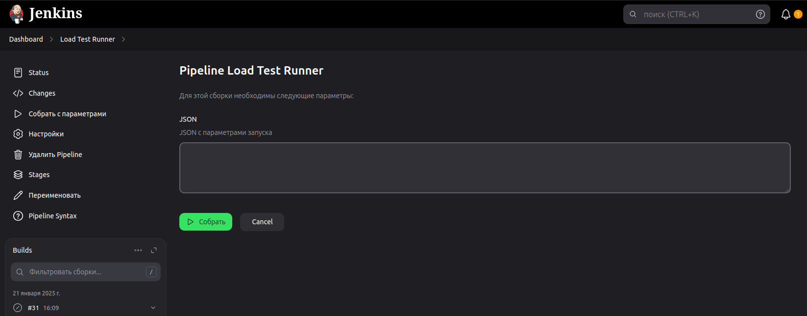
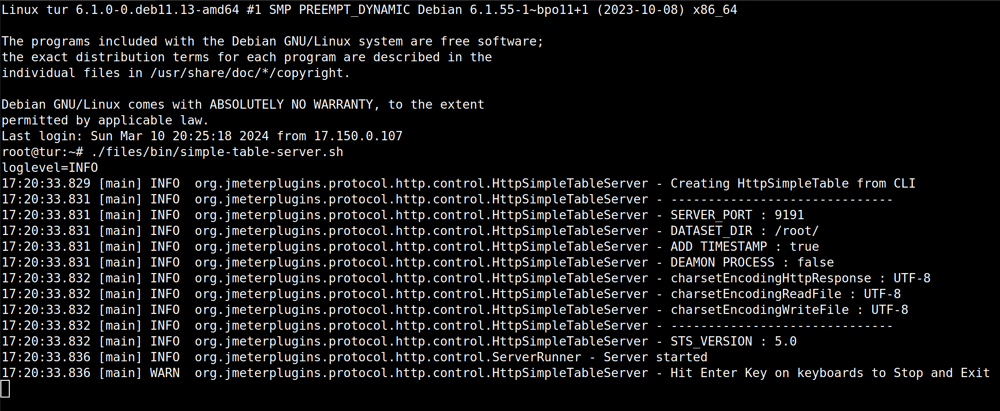
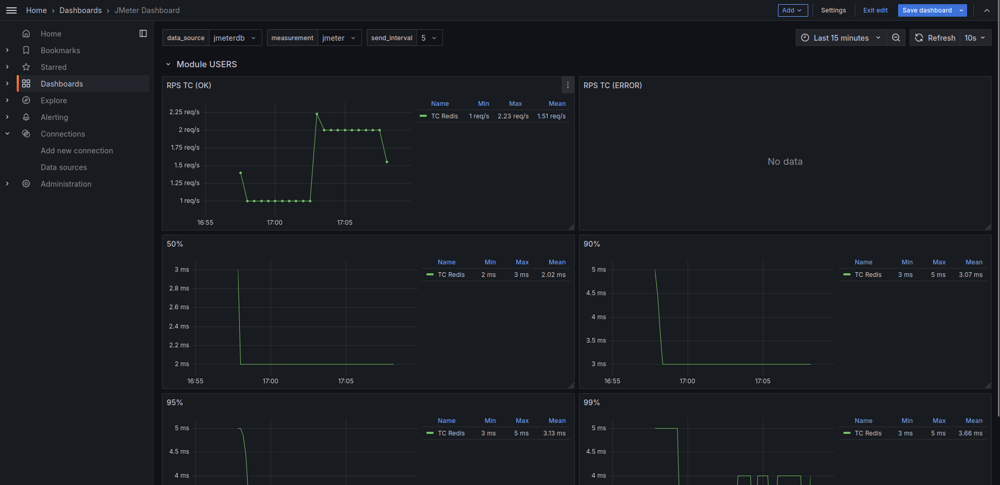

# JMeter-Tests-Users
Тестирование сайта <a href="http://users.bugred.ru/">Users</a> (Нагрузочное тестирование)

## Описание

Пример тестового фреймворка для быстрого старта на JMeter. Сайт для тестирования (<a href="http://users.bugred.ru/">Users</a>).

## Состав проекта

- Папка (jenkins) с pipeline;
- Папка (tests) с нагрузочными тестами;
- Папка (test_data) с данными для теста;
- Скрипт (pre_generate_users) для генерации данных в STS.

## Параметры запуска

```json
{
  "TESTS_PARAM": [
    {
      "JOB": {
        "GENERATOR": "main",
        "TEST_NAME": "AuthorizationTest"
      },
      "PROFILE": [
        {
          "THREAD_GROUP_NAME": "AuthorizationTest",
          "SCRIPT_EXECUTION_TIME": 5,
          "PACING_MULTIPLIER": 3,
          "STEPS": [
            {
              "TPS": 1.0,
              "RAMP_TIME": 0.5,
              "HOLD_TIME": 5.0
            },
            {
              "TPS": 2.0,
              "RAMP_TIME": 0.5,
              "HOLD_TIME": 5.0
            }
          ]
        }
      ],
      "PROPERTIES": {
        "REDIS_CLIENT_HOST": "192.168.31.252"
      }
    }
  ],
  "COMMON_SETTINGS": {
    "JMX": {
      "MODULE_NAME": "MODULE_ONE",
      "PERCENT_PROFILE": 100.0,
      "TEST_FOLDER_PATH": "/home/main/test"
    },
    "PROPERTIES": {
      "INFLUXDB_HOST": "localhost",
      "API_GATEWAY": "localhost",
      "WAIT": "0"
    }
  }
}
```

Описание параметров:

* **TESTS_PARAM** - Параметры тестов;
    * **JOB** - Параметры для Java машины;
        * **JVM_ARGS** - Аргументы Java машины (ограничения по ОЗУ);
        * **GENERATOR** - Где будет запускаться тесты;
        * **TEST_NAME** - Наименования тестового класса;
        * **TEST_FOLDER** - Путь до класса в проекте;
    * **PROFILE** - Параметры профиля нагрузки;
        * **Array profile** - Массив профилей для разных катушек;
            * **THREAD_GROUP_NAME** - Наименование катушки;
            * **SCRIPT_EXECUTION_TIME** - Время выполнения запроса (**Thread Group**);
            * **PACING_MULTIPLIER** - Множитель для Pacing (**Thread Group**);
            * **STEPS** - Шаги профиля: **TPS** - подаваемая нагрузка, **RAMP_TIME** - выход на заданную интенсивность (
              мин) и **HOLD_TIME** - удержание нагрузки (мин);
    * **PROPERTIES** - Дополнительные параметры для теста.


* **COMMON_SETTINGS** - Параметры для все тестов;
    * **JMX** - Параметры для bash скрипта;
        * **MODULE_NAME** - Название модуля (используется для сбора логов);
        * **PERCENT_PROFILE** - Процент профиля;
        * **TEST_FOLDER_PATH** - Папка где находится jar архив;
    * **PROPERTIES** - Дополнительные общие параметры для всех тестов.

### Запуск тестов через Jenkins

<p>Параметры запуска:</p>



### Запуск тестов через CLI

```bash
jmeter -n -t ./MODULE_ONE/AuthorizationTest.jmx 
       -l ./AuthorizationTest.jtl 
       -e -o ./AuthorizationTest 
       -JAPP_GATEWAY=localhost -JINFLUXDB_HOST=localhost -JREDIS_CLIENT_URL=localhost -JWAIT=0
       -Jthreads_schedule='spawn(15,0s,30s,300s,30s) spawn(30,330s,30s,300s,30s)' -JTHROUGHPUT_TIMER=4.0
```

## Настройка STS

Запуск Simple Table Server



## Мониторинг Grafana + InfluxDB

Дашбод Grafana

Путь до дашборда: **./monitoring/Jmeter Dashboard.json**

